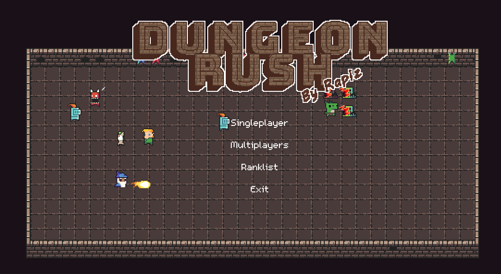

# DungeonRush

>A game inspired by Snake, in pure C with SDL2.
>My piece of work from C assignment. Hope you like it :)

*I work on the small project on my own so the code lacks of comments.*

## Download

[Windows(64bit)](https://github.com/Rapiz1/DungeonRush/releases/download/v1.1-beta/DungeonRush-v1.1-beta-Windows-x86_64.zip)

[Windows(32bit)](https://github.com/Rapiz1/DungeonRush/releases/download/v1.1-beta/DungeonRush-v1.1-beta-Windows-i686.zip)

[Linux](https://github.com/Rapiz1/DungeonRush/releases/download/v1.1-beta/DungeonRush-v1.1-beta-linux.zip)

[Someone port it to android!](https://github.com/imrunning/DungeonRush_Android)

AppImage for Linux is also available in release page.

[Archlinux AUR](https://aur.archlinux.org/packages/dungeonrush/)

```yay -S dungeonrush```

[Archlinux AUR(git version)](https://aur.archlinux.org/packages/dungeonrush-git/)

```yay -S dungeonrush-git```

*The game supports macOS but I don't have an Mac to compile for it.*

The executable is called `dungeon_rush`

## Release Note

### v1.1-beta
- Fix bugs

### v1.0-beta
- Fix bugs
- Add Multiplayer / LAN mode

**You can play with your friend via Internet!**
*You need to be in the same network and can directly connect by IP*

### v1.0-alpha

Initial release

## How to Play

### Singleplayer

Use WASD to move.

Collect heros to enlarge your army while defending yourself from the monsters. Each level has a target length of the hero queue. Once it's reached, you will be sent to the next level and start over. There are lots of stuff that will be adjusted according to the level you're on, including factors of HP and damage, duration of Buffs and DeBuffs, the number and strength of monsters and so on.

### Multiplayers
Use WASD and the arrow keys to move.

This mode is competitive. Defend yourself from the monsters and your friend!

### Weapons

There are powerful weapons randomly dropped by the monsters. Different kinds of heros can be equipped with different kind of weapons.

*My favorite is the ThunderStaff. A cool staff that makes your wizard summon thunder striking all enemies around.*

### Buff/DeBuff

There's a possibility that the attack from one with weapon triggers certain Buff on himself or DeBuff on the enemy.

- IceSword can frozen enemies.
- HolySword can give you a shield that absorbs damage and makes you immune to DeBuff.
- GreatBow can increase the damage of all your heros' attack.
- And so on.

For sure, some kinds of monsters have weapons that can put a DeBuff on you! *(Like the troublesome muddy monsters can slow down your movement.)*

## Dependencies
The project requires no more than common SDL2 libraries.
`SDL2, SDL2-image, SDL2-mixer, SDL2-net, SDL2-ttf`
### For Arch
```
# pacman -S sdl2 sdl2_image sdl2_mixer sdl2_net sdl2_ttf --needed
```
### For Debian

```
# apt install libsdl2-dev libsdl2-image-dev libsdl2-mixer-dev libsdl2-net-dev libsdl2-ttf-dev
```

### For openSUSE

```
# zypper in libSDL2-devel libSDL2_image-devel libSDL2_mixer-devel libSDL2_net-devel libSDL2_ttf-devel
```

### For MacOS

```
#  brew install sdl2 sdl2_image sdl2_mixer sdl2_net sdl2_ttf
```

### For other OS

The names of packages should be similar. You can look for SDL tutorial to set up the environment.
## Compilation
**You should make sure all dependencies are installed before compiling**
```
$ cmake -B build && cmake --build build
```
## Known issues
[Game speed too fast with some NVIDIA graphic cards on Linux](https://github.com/Rapiz1/DungeonRush/issues/4)
## License and Credits
DungeonRush has mixed meida with 
various licenses. Unfortunately I failed to track them all. In other word, there are many stuff excluding code that comes with unknown license. You should not reuse any of audio, bitmaps, font in this project. If you insist, use at your own risk.
### Code
GPL
### Bitmap
|Name|License|
|----|-------|
|DungeonTilesetII_v1.3 By 0x72|CC 0|
|Other stuff By rapiz|CC BY-NC-SA 4.0|
### Music
|Name|License|
|----|-------|
|Digital_Dream_Azureflux_Remix By Starbox|CC BY-NC-SA 4.0|
|BOMB By Azureflux|CC BY-NC-SA 4.0|
|Unknown BGM|Unknown|
|The Essential Retro Video Game Sound Effects Collection By Juhani Junkala |CC BY 3.0|
